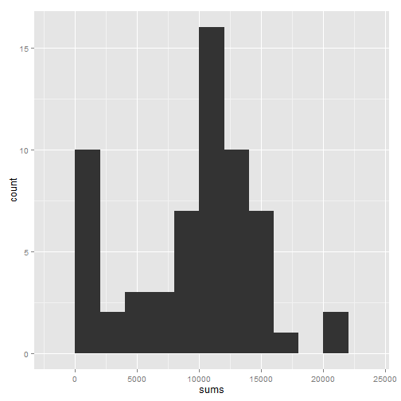
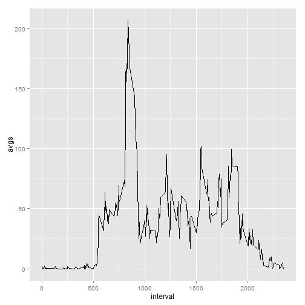
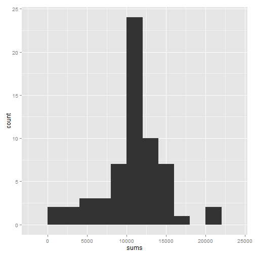
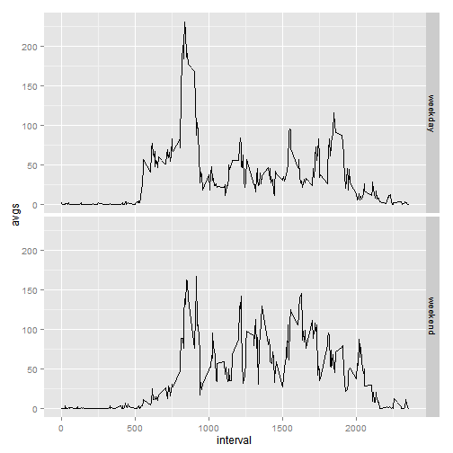

## Loading and preprocessing the data


```r
#load packages
library(dplyr, warn.conflicts = FALSE) 
library(ggplot2)

#load data
data_activity <- read.csv("./activity.csv")

#sum of steps per day, missing data ignored
sum_of_steps <- group_by(data_activity, date) %>% summarize(sums = sum(steps, na.rm = TRUE))
```

## What is mean total number of steps taken per day?

```r
mean_sum_of_steps <- round(mean(sum_of_steps$sums, na.rm = TRUE))
median_sum_of_steps <- median(sum_of_steps$sums, na.rm = TRUE)
qplot(sums, data = sum_of_steps, binwidth = 2000)
```

 

If missing values in the dataset are ignored (in case of summing up number of steps per day ignoring NAs means that NA is replaced by 0 - it's not a good idea though, more about it later), then mean of total steps per day equals to 9354, and median = 10395. But, as one can derive from a histogram, missing values shouldn't be just ignored. Missing values aren't spread evenly in the dataset, they are cumulated in certain days, so significant number of days have total number of steps close or equal to 0. This affects the mean and the median, as a result both are underestimated.


## What is the average daily activity pattern?


```r
#average number of steps per interval, missing data ignored
avg_of_steps <- group_by(data_activity, interval) %>% summarize(avgs = mean(steps, na.rm = TRUE))
stepmax <- avg_of_steps$interval[avg_of_steps$avgs == max(avg_of_steps$avgs)]
qplot(interval, avgs, data = avg_of_steps, geom = "line")
```

 

As is clearly visible in the plot, the peak of average number of steps covers morning rush hours. So it's not a suprise that maximum (average) number of steps occurs at 8:35 AM (interval = 835)

## Imputing missing values

```r
nanumber <- sum(is.na(data_activity$steps)) #NAs total
```

As stated above, missing values aren't distributed evenly within dataset, so there's a need to do something with NAs (there are 2304 NAs in dataset). Let replace NAs with mean for each interval.  


```r
options(scipen=999) #needed for properly display values in a text below
stepmeans <- aggregate(steps ~ interval, mean, data = data_activity) #mean values for each interval
newdataset <- merge(data_activity, stepmeans, by.x = "interval", by.y = "interval", all = TRUE) #add a column with means for each interval to main dataset
newdataset[is.na(newdataset$steps.x),]$steps.x <- newdataset[is.na(newdataset$steps.x),]$steps.y #replace NAs with means
sum_of_steps <- group_by(newdataset, date) %>% summarize(sums = sum(steps.x)) #sum of steps per day
mean_sum_of_steps <- round(mean(sum_of_steps$sums))
median_sum_of_steps <- round(median(sum_of_steps$sums))
qplot(sums, data = sum_of_steps, binwidth = 2000)
```

 

Replacing NAs with interval means gives a much better view of activity and a total number of steps per day. Now mean equals to 10766, and median to 10766, and only now values of these coefficients reflect reality. 

## Are there differences in activity patterns between weekdays and weekends?


```r
Sys.setlocale("LC_ALL", "English") #needed for weekdays function, which returns a character vector of names in the locale in use
```

```r
newdataset <- mutate(newdataset, weekend = ifelse(weekdays(as.POSIXlt(newdataset$date), abbreviate = TRUE) %in% c("Sat", "Sun"), "weekend", "weekday")) #a new factor variable added to the dataset
avg_of_steps <- group_by(newdataset, interval, weekend) %>% summarize(avgs = mean(steps.x))
qplot(interval, avgs, data = avg_of_steps, geom = "line", facets = weekend ~ .)
```

 

There are substantial differences in activity patterns between weekdays and weekends.
